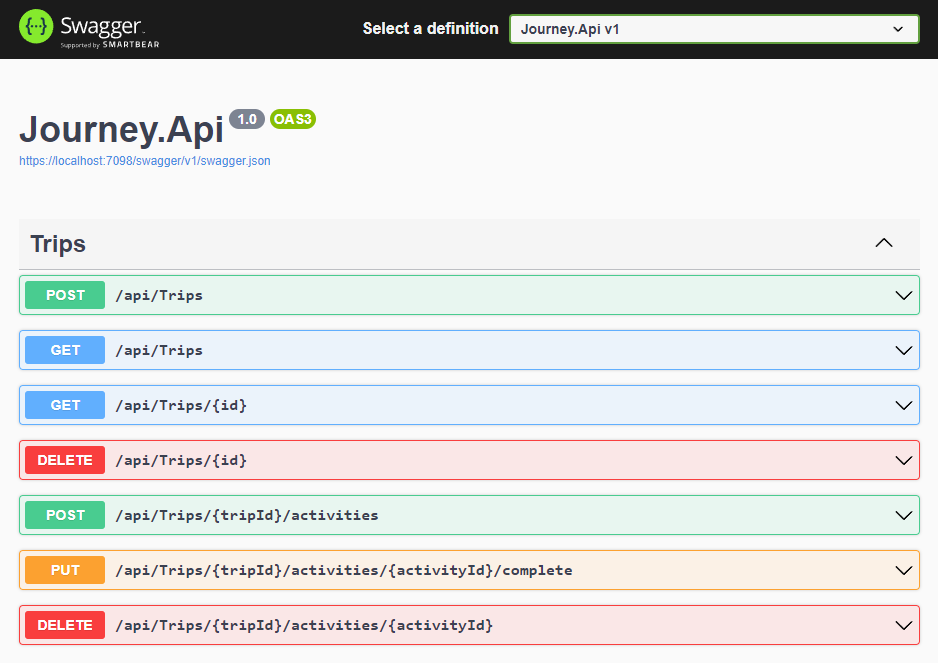

# NLW Journey

API de gestão de viagen criada na trilha de C# do evento NLW Journey da Rocketseat. Utiliza .NET 8, EF Core, SQLite e FluentValidation.

Melhorias implementadas:

- Injeção de dependência, não ter tantos “new” pelo código, diminui o acoplamento e aumenta a testabilidade.
- Programação assíncrona, usando Task, async e await, melhora a escalabilidade
- Mapping entre entidades e DTOs, na aula é sugerido AutoMapper, eu optei por métodos de extensão, centraliza a lógica de mapeamento.
- TimeProvider, um tipo novo do .NET 8, facilita testar lógica que utiliza DateTime.Now ou UtcNow.
- Projeção com EF Core, uma query pode retornar um tipo diferente da entidade, como um DTO, pode melhorar a performance.
- Testes de unidade e integração para verificar se a aplicação funciona conforme o esperado, aqui usei xUnit, FluentAssertions, NSubstitute, SQLite em memória, FakeTimeProvider e WebApplicationFactory.
